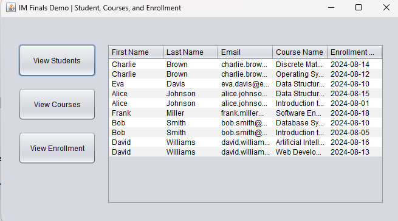
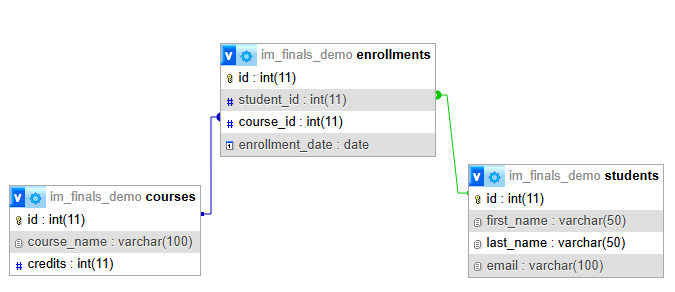

# IM Finals Demo
This demo demonstrates how to use Java to perform SQL JOIN operations on a MySQL database and display the resulting data in a JTable for easy visualization and interaction.

### Preview



### ERD



```sql
SELECT s.first_name, s.last_name, s.email, c.course_name, e.enrollment_date
FROM students s
JOIN enrollments e ON s.id = e.student_id
JOIN courses c ON e.course_id = c.id
ORDER BY s.last_name, c.course_name;
```

### OOP Design: MVVM (Model-View-ViewModel)

* The Model is the data and logic layer.
* The View is what the user sees.
* The ViewModel binds the two together, managing the data and logic for the View without directly touching the UI.

### Challenge
- [ ] **C1**. it should click the Courses button and display the courses details in a JTable.
- [ ] **C2**. it should click the Enrollment button and dsiplay the enrollment details in a JTable.
